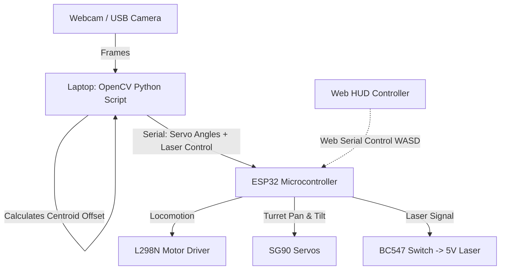

# 🤖 LaserBot Apex-1: Target Tracking & Aiming Robot Platform

[](LICENSE)
[](https://www.espressif.com/en/products/socs/esp32)
[](https://opencv.org/)
[](https://developer.mozilla.org/en-US/docs/Web/API/Web_Serial_API)

Welcome to the official repository for **LaserBot Apex-1**—a custom-engineered target tracking and autonomous aiming mobile robot.

This repository contains the complete firmware, computer vision code, web control dashboard telemetry HUD, and hardware connection schematics required to construct and run the robot.

---

## 📐 System Architecture

Apex-1 integrates three primary software and hardware components to acquire targets and navigate:



---

## 🛠️ Hardware Requirements (BOM)

To construct this robot, you will need the following physical items:

| Qty | Component Name | Description | Purpose |
| :---: | :--- | :--- | :--- |
| **1** | **ESP32 DevKit v1 (30-pin)** | Main microcontroller board with Wi-Fi & Dual Core. | Robot brain & Serial Parser |
| **1** | **L298N Motor Driver Module** | H-Bridge driver for dual DC motors. | Chassis locomotion |
| **1** | **2WD Smart Car Chassis Kit** | Includes acrylic base plate, 2 DC motors, wheels, and front caster. | Robot body base |
| **2** | **SG90 9g Micro Servos** | Standard positional feedback micro servos. | Pan & Tilt turret actuation |
| **1** | **Pan-Tilt Turret Mount** | 2-Axis nylon or 3D-printed servo bracket. | Holds the laser and servos |
| **1** | **5V Red Laser Diode Module** | Class 2 low-power laser emitter (<1mW). | Target pointer |
| **1** | **BC547 NPN Transistor** | Standard transistor used to switch the laser. | Transistor driver switch |
| **1** | **220Ω Resistor** | Limits current from the ESP32 pin to the transistor. | Safety current limiter |
| **2** | **18650 Li-ion Batteries** | Rechargable 3.7V batteries (wired in series for 7.4V). | Main power source |
| **1** | **18650 Dual Battery Case** | Holder with red/black lead wires. | Battery holder |
| **1** | **Solderless Breadboard & Wires** | Jumper cables (Male-to-Male and Female-to-Male). | Circuit hookups |

---

## 🔌 Electrical Connections (Schematic)

Connect the hardware components together according to the following wiring configuration:

| From Component | Pin Name | To Component | Pin Name | Notes |
| :--- | :---: | :--- | :---: | :--- |
| **Battery (+)** | 7.4V (+) | **L298N Driver** | 12V Terminal | Main power input |
| **Battery (-)** | GND (-) | **L298N Driver** | GND Terminal | Common system ground |
| **L298N Driver** | GND Terminal | **ESP32** | GND | Common reference |
| **L298N Driver** | 5V Out | **ESP32** | Vin | Powers ESP32 board |
| **L298N Driver** | 5V Out | **Both Servos** | Red (+) Wires | Powers servo motors |
| **ESP32** | GPIO 12 | **L298N Driver** | IN1 | Left Motor Forward |
| **ESP32** | GPIO 13 | **L298N Driver** | IN2 | Left Motor Backward |
| **ESP32** | GPIO 14 | **L298N Driver** | IN3 | Right Motor Forward |
| **ESP32** | GPIO 27 | **L298N Driver** | IN4 | Right Motor Backward |
| **ESP32** | GPIO 19 | **SG90 Pan Servo** | Yellow (PWM) | Turret horizontal sweep |
| **ESP32** | GPIO 18 | **SG90 Tilt Servo** | Yellow (PWM) | Turret vertical pitch |
| **ESP32** | GPIO 23 | **220Ω Resistor** | Pin 1 | Laser control signal |
| **220Ω Resistor** | Pin 2 | **BC547 Transistor**| Base (B) pin | Transistor trigger input |
| **BC547** | Collector (C) | **Laser Module (+)** | Red wire | Laser power switch line |
| **BC547** | Emitter (E) | **GND** | GND | Transistor ground |
| **Laser Module** | Black wire (-) | **GND** | GND | Common ground |

---

## 🚀 Step-by-Step Software Setup

First, clone this repository to your computer and navigate into the project folder:
```bash
git clone https://github.com/Rashid-RG/laserbot-competition.git
cd laserbot-competition
```

Follow these steps to upload the code and start running your robot:

### Step 1: Upload the ESP32 Firmware
1. Open the [Arduino IDE](https://www.arduino.cc/en/software).
2. Go to **File** → **Preferences** and paste this URL into the *Additional Boards Manager URLs* box:
   `https://raw.githubusercontent.com/espressif/arduino-esp32/gh-pages/package_esp32_index.json`
3. Go to **Tools** → **Board** → **Boards Manager**, search for `esp32` (by Espressif), and click **Install**.
4. Install the servo driver library: Go to **Sketch** → **Include Library** → **Manage Libraries**, search for `ESP32Servo`, and click **Install**.
5. Connect your ESP32 board to your computer using a micro-USB cable.
6. Open the file [firmware/firmware.ino](firmware/firmware.ino) in Arduino IDE.
7. Go to **Tools** → **Board** and select your ESP32 model (e.g. *ESP32 Dev Module*).
8. Go to **Tools** → **Port** and select your COM Port.
9. Click **Upload** (the right-pointing arrow icon).

---

### Step 2: Set Up Computer Vision (Auto-Aiming)
1. Install [Python](https://www.python.org/downloads/) on your computer. *(Make sure to check "Add Python to PATH" during installation).*
2. Plug a USB webcam into your laptop.
3. Open a Command Prompt or Terminal, and navigate to the project's vision directory:
   ```bash
   cd vision
   ```
4. Install required libraries:
   ```bash
   pip install -r requirements.txt
   ```
5. Run the tracker:
   ```bash
   python auto_aim.py
   ```
   *Your camera stream will open. Place a red target in the frame, and the script will lock on it and send rotation commands directly to your ESP32 turret.*

---

### Step 3: Run the Web HUD Remote Controller
If you want to manually test your robot, drive it, or calibrate servos using WASD keys:
1. Double-click the file [index.html](index.html) at the root folder to open the dashboard redirect, or directly open [web-control/index.html](web-control/index.html) in Google Chrome or Microsoft Edge.
2. Click **Connect Robot Serial Port** in the top navigation bar.
3. Select your ESP32 board's COM port from the browser window and click **Connect**.
4. **Controls**:
   - Drive: Use **W, A, S, D keys** on your keyboard (Hold to move, release to stop).
   - Aim: Adjust the sliders on the screen, or use the **Arrow keys**.
   - Laser: Press and hold the **Spacebar** to shoot the laser, or click the **EMIT LASER** button.
